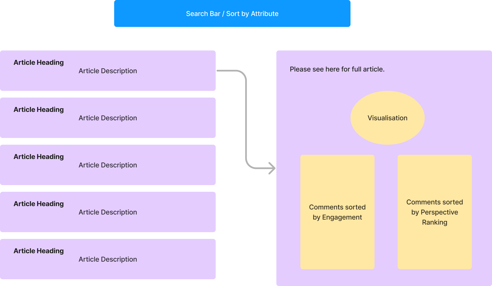

# a-bridge-for-tom

An analysis of Times of Malta (ToM) article comments, showcasing engagement-based vs bridging-based ranking systems. The goal of this project is to seek ways in which constructive and respectful interactions among commenters can be encouraged.

ToM was chosen due to its observed polarisation and contentious nature within the comment section. As a reader myself, I was particularly interested in addressing and improving the tone and substance of discussions on the platform.

Article sample:

```
{
    "people-ask-inquiry-treated-muscat-officials-unfairly-pm.1092038": {
        "title": "'People should ask why inquiry treated Muscat and other officials unfairly' - PM",
        "description": "Abela tells reporters he did not see inquiry, but pokes specific holes in it",
        "content": "Joseph Muscat and other officials who face criminal charges in court over the hospitals' inquiry are innocent until proven guilty and there is no reason why they should be kicked out of their positions, Robert Abela said on Monday. The Vitals magisterial inquiry...",
        "author": "Mark Laurence Zammit",
        "date_published": "2024-05-06T20:05:00+02:00",
        "tags": [
            "National",
            "Hospitals deal",
            "Robert Abela",
            "Government",
            "Joseph Muscat"
        ]
    }
}
```

Comment sample:

```
{
    "94b88d8caa544521": {
        "author": "[REDACTED]",
        "published_date": "Monday, May 6, 2024 8:35 PM",
        "published_date_timestamp": 1715020500,
        "comment": "In 90 mins, Robert Abela found time time to defend Joseph Muscat and others who stand accused but found no time to defend the victims of the crime i.e. the taxpayer who was robbed of 400 million.",
        "likes": "52",
        "dislikes": "1",
        "replies": [
          {
            "bc227cb52634f441": {
              "author": "[REDACTED]",
              "published_date": "Tuesday, May 7, 2024 7:03 AM",
              "published_date_timestamp": 1715058180,
              "comment": "Bobby has signed his and the Labour party's  own \"Goodbye\" warrant,  by not standing up to prevent corruption but instead to have the gall to  actually defend those involved in what has been proven to be corruption by the highest Courts of this nation.Bye, bye Bobby and cronies   -  even Gahans aren't that stupid and blind that they'll vote for uncaring, selfish, greedy politicians next time round!",
              "likes": "7",
              "dislikes": "0",
              "replies": []
            }
          }
        ]
    }
}
```

1,857 articles and their comments were gathered between February and July 2024.

